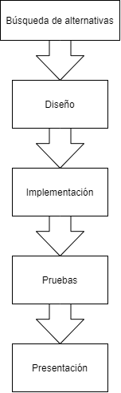

.. _dop:

***********************************
Documento de objetivos del proyecto
***********************************

Descripción del proyecto
########################

El proyecto se trata de una página web en la que el usuario inicia sesión con su cuenta de Twitter
y, cuando se cedan los permisos que se piden, el usuario dispondrá de un buscador en el cual podrá 
introducir lo que quiera buscar. Esto generará un listados con los tweets que tengan una ubicación añadida, y 
con ellas el usuario será capaz de marcarlas en un mapa para conocer la ubicación exacta.

Objetivos del proyecto
######################

El objetivo de este proyecto es aplicar diferentes mejoras a una aplicación 
ya implementada. También se basará en aprender a utilizar correctamente herramientas 
de control de versiones, además de comparar diferentes alternativas.

Para las mejoras de la aplicación se tratará de ampliar las funciones con las que 
dispone la aplicación original. Además de realizar mejoras en el diseño de la aplicación web, se 
sustituirá la API Google Maps por una alternativa libre como OpenStreetMaps.

Herramientas
############

Para el despliegue de la página web se utilizará la plataforma de **Google Cloud**, ya que la aplicación original, 
en la que nos basamos, esta implementada en esta plataforma.

Se utilizará **GitHub** como herramienta de almacenamiento, tanto para la documentación como para el código, 
además de usarlo para la gestión de versiones. El proyecto con la documentación se enlazara a **Read the Docs** 
la cual procesa los archivos para mostrarlos en una página web.

Por otro lado, para la planificación y la gestión del proyecto se hará uso de la herramienta **GanttProject**.

Alcance del proyecto
####################

A continuación se hablara del ciclo de vida del proyecto, además de definir las fases y funcionalidades 
adicionales que vamos a implementar en nuestro proyecto. 

Ciclo de vida
+++++++++++++

Se ha decidido utilizar un ciclo de vida lineal, ya que es sencillo de gestionar y las etapas están muy bien 
diferenciadas. Nuestro proyecto de mejora consta de las siguientes etapas:

  
  Figura 1 - Ciclo de vida lineal
  

Fases del proyecto
++++++++++++++++++

	* **Planificación y gestión:** Para la correcta realización del proyecto se harán reuniones internas 
	  periódicas para planificar las tareas a realizar. Además de discutir las diferentes opciones que se puedan utilizar en 
	  la mejora del proyecto.
	* **Documentación:** A lo largo del proyecto se irá creando la documentación necesaria para el proyecto, como 
	  por ejemplo: las actas de reunión, el documento de objetivos del proyecto, la documentación del código.
	* **Desarrollo:** Con la captura de requisitos, se implementara las mejoras a la página web siguiendo el 
	  diseño establecido.
	* **Pruebas:** Ya terminado el proyecto se harán las pruebas necesarias para verificar el correcto funcionamiento 
	  de la aplicación web.
	* **Finalización:** Esta última fase consistirá de preparar la presentación.

Estructura de descomposición del trabajo
++++++++++++++++++++++++++++++++++++++++

