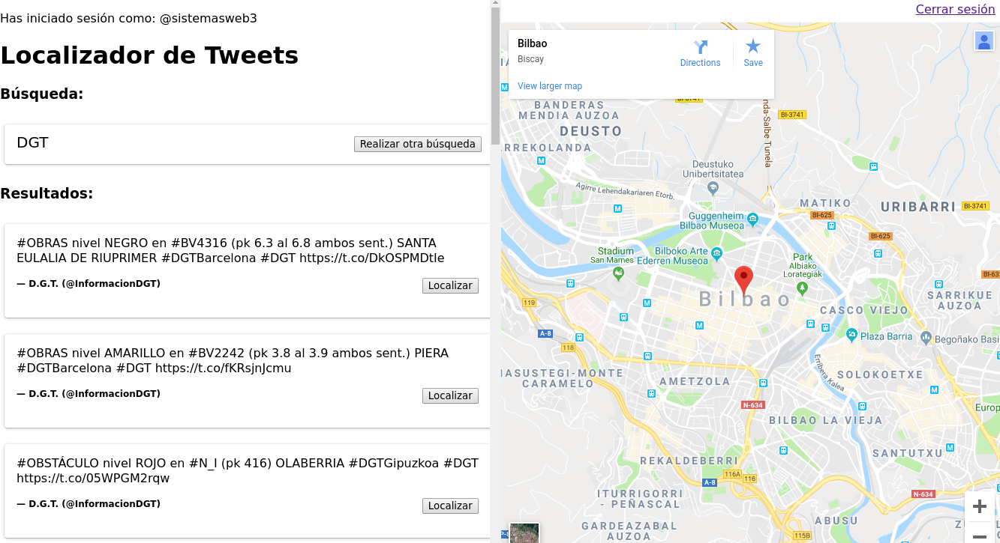

.. _dop:

Documento de objetivos del proyecto
###################################

En el documento de objetivos del proyecto se recoge gran parte de la documentación del proyecto, incluyendo su descripción, los objetivos, los criterios con los que se han elegido las herramientas y el alcance.

Descripción del proyecto
************************

El proyecto trata de mejorar una página web desarrollada para la asignatura de Sistemas Web.
La aplicación permite al usuario, tras iniciar sesión con su cuenta de Twitter, hacer búsquedas de *tweets* geolocalizados por palabras clave.
La lista de *tweets* obtenida como resultado se mostrará al lado de un mapa y el usuario podrá seleccionar el *tweet* que quiera para situarlo.

En la :numref:`old_1` se muestra la pantalla de inicio de la aplicación a mejorar, previo a que el usuario haya conectado su cuenta de Twitter.

.. _old_1:

  
  Inicio de la versión antigua de la aplicación (sin sesión iniciado)

Por otro lado, en la :numref:`old_2` se muestra la pantalla de inicio una vez el usuario ha iniciado sesión, donde el usuario puede realizar las búsquedas.

.. _old_2:

  
  Inicio de la versión antigua de la aplicación (con sesión iniciado)

Finalmente, la figura :numref:`old_3` muestra los resultados de una búsqueda, junto al mapa que permite localzar los *tweets*.

.. _old_3:

  
  Resultado de búsqueda de la versión angitua de la aplicación

Objetivos del proyecto
**********************

El objetivo de este proyecto es aplicar diferentes mejoras a una aplicación ya implementada.
También se basará en aprender a utilizar correctamente herramientas de control de versiones, además de comparar diferentes alternativas.

Para las mejoras de la aplicación se tratará de ampliar las funciones con las que dispone la aplicación original.
Además de realizar mejoras en el diseño de la aplicación web, se sustituirá la API Google Maps por una alternativa libre.
.. como OpenStreetMaps.

Herramientas
************

En esta sección se describen las herramientas empleadas para llevar a cabo el proyecto. Además, en el caso de el sistema de control de versiones y el gestor de documentación, se realiza un análisis de las alternativas que se han considerado y se explican las razones por las que se han elegido las que finalmente se han utilizado.

Sistema de control de versiones
===============================

Un sistema de control de versiones permite gestionar los cambios que se hacen sobre **software**, documentos y demás elementos basados en algún tipo de código fuente. Existen múltiples sistemas de este tipo, pero se han considerado dos, Git y Subversion (SVN), como posibles alternativas para este proyecto.

Git
---

Git, desarrollado originalmente por Linus Torvalds, creado del kernel Linux, es el sistema de control de versiones más popular hoy en día, distribuido bajo la licencias licencias *free software* GPLv2 y LGPLv2.1.

Es de arquitectura distribuida, lo que significa que existe una copia del repositorio y su historial completo de cambios en el sistema de cada desarrollador. También es descentralizado, lo que posibilita que los cambios puedan realizarse de manera local para posteriormente ser sincronizados con el resto de copias, sin requerir tener acceso a un servidor central y por tanto sin requerir tener Internet para realizar cambios en el repositorio (aunque esto último, hoy en día, no suponga realmente un problema). Otro aspecto a favor de Git es su buen rendimiento.

Dada su popularidad, ha sido utilizado previamente en muchas asignaturas del curso, por lo que se cuenta con experiencia previa, lo que compensa que la curva de aprendizaje sea relativamente inclinada.

Subversion
----------

Subversion, conocido por las siglas SVN, es otro sistema de control de versiones, también de código abierto y con licencia *free software* (Apache License) y desarrollado por la Apache Software Fundation.

Su arquitectura es centralizada, es decir, debe existir un servidor central en el que el repositorio se aloja el código y los cambios realizados. Esto implica que el usuario, desde su sistema, no puede crear, por ejemplo, *commits* de manera local. Debe tener acceso al servidor (y por tanto a Internet) para poder aplicar los cambios en el repositorio, alojado en el servidor central.

Hoy en día, aunque utilizado por diversos proyectos, no es de gran popularidad. Esto supone que no hay tanta información por parte de la comunidad, porque esta es más pequeña, y, por tanto, a la hora de resolver problemas que puedan surgir probablemente no sea tan fácil encontrar respuestas en foros como StackOverflow como lo puede ser con otros sistemas de control de versiones más populares.

Git vs. Subversion
------------------

A continuación, teniendo en cuenta las características, ventajas y desventajas de los sistemas de control de versiones descritos, se presenta una tabla que recoge los criterios que se han tenido en cuenta a la hora de elegir el sistema empleado.

+------------------------------+------------------------------+--------------------------------------+
| **Criterios/Herramientas**   | Git                          | Subversion                           |
+==============================+==============================+======================================+
| **Popularidad**              | Alta                         | Baja                                 |
+------------------------------+------------------------------+--------------------------------------+
| **Licencia**                 | GPLv2/LGPLv2.1               | Apache License                       |
+------------------------------+------------------------------+--------------------------------------+
| **Curva de aprendizaje**     | Relativamente inclinada      | No tan inclinada, fácil de aprender  |
+------------------------------+------------------------------+--------------------------------------+
| **Experiencia previa**       | Se ha empleado anteriormente | Sin experiencia previa               |
+------------------------------+------------------------------+--------------------------------------+
| **Local/Remoto**             | Se pueden usar localmente    | Requiere tener acceso a un servidor  |
+------------------------------+------------------------------+--------------------------------------+
| **Arquitectura**             | Distribuida, descentralizada | Centralizada                         |
+------------------------------+------------------------------+--------------------------------------+
| **Rendimiento**              | Rápido                       | Medio                                |
+------------------------------+------------------------------+--------------------------------------+

Ambos tienen **licencias** permisivas, aunque Apache es menos restrictiva, ya que no requiere el *software* se distribuya bajo la misma licencia ni restringe la comercialización. En este aspecto, más bien de carácter legal, no se ha hecho mucho énfasis, dado que, a efectos prácticos, no se ha pensado en ninguna diferencia entre usar una y otra en este proyecto.

En cuanto a la **popularidad**, se considera que Git cuenta con el punto a favor de contar con una comunidad de desarrolladores inmensa, a diferencia de SVN, que no es ni remotamente tan popular. Existe, por tanto, mucha documentación sobre Git (aunque también hay que tener en cuenta que más no es necesariamente mejor, y que, junto a tanta información, también habrá mucho ruido).

La **curva de aprendizaje** y la **experiencia previa** deben analizarse en conjunto. Si bien es cierto que es popularmente aceptado que Git es más difícil, dada su popularidad, ha sido la herramienta utilizada en asignaturas previas, y no se cuenta con experiencia previa utilizando SVN, aunque sea más sencillo. Esto compensa que la curva de aprendizaje sea marcada.

Finalmente, entrando en temas más técnicos, aunque con implicaciones prácticas, la **arquitectura** de Git, descentralizada y distribuida, se considera más apropiada por preferencia personal de los miembros del grupo que la de Subversion, que es centralizada. La idea de tener el repositorio completo en nuestros sistemas y poder hacer cambios en **local** sin depender del acceso a un servidor central es preferible. Git es, además, superior a SVN en términos de rendimiento.

La decisión final, por tanto, ha sido utilizar Git. Cabe decir, además, que se ha elegido GitHub como servicio para el *hosting* del repositorio principal, dado que permite ser sincronizado con el gestor de documentación elegido. Esto permite que bien el código y bien la documentación residan en el mismo repositorio y sean gestionados de manera conjunta por el mismo sistema de control de versiones. Además, como se verá, el gestor de documentación leerá el código automáticamente para incluirlo.

Gestor de documentación
=======================

El término gestor de documentación abarca todas aquellas aplicaciónes utilizadas para administrar los documentos necesarios de un proyecto de manera digital y colaborativa. Para ello, se consideran las siguientes opciones de software libre para seguir con la linea de proyecto **open source**.

.. Un gestor de documentación permite trabajar de manera colaborativa

Wikis
-----

Término procediente del hawaiano y que significa rápido, se denomina a comunidades donde los usuarios crean, modifican o eliminan contenidos que comparten, generalmente, a través de páginas web.

La tarea principal de estos wikis se trata de crear enciclopedias colectivas o diccionarios con el fin de compartir conocimientos y o textos dentro de diferentes grupos. Para lograr una idea más clara de esta herramienta, solo se debe pensar en páginas web como Wikipedia, WikiHow, etc. basadas en wikis y mundialmente conocidas.

La mayor parte de wikis registran un historial de cambios a modo de línea de tiempo. De esta manera, la coordinación entre los usuarios resulta mas fácil, permite recuperar ediciones anteriores y quedan registrados todos los cambios realizados en el tiempo.

Sphinx
------

Sphinx es un generador de documentación de software libre originalmente desarrollado para el lenguaje de programación Python y que posteriormente se extendió a un amplio rango de lenguajes.

Su función principal consiste en convertir ficheros **reStructuredText** en sitios web HTML y otros formatos como PDF, EPub y man. Este lenguaje permite escribir textos con formato definido de manera rápida y cómoda, y está formalizado dentro del grupo **Python Doc-SIG (Documentation Special Interest Group)**.

Sphinx utiliza este tipo de ficheros por su facilidad de adaptación y manejabilidad, tanto que, desde su lanzamiento en 2008, proyectos importantes como **Django, SQLAlchemy, Bazaar, etc.** lo utilizan para generar la documentación.

Al igual que en Git y el servicio de hosting GitHub, Sphinx también cuenta con un servicio de hosting llamado **Read The Docs** que se ha utilizado en este proyecto.

Wikis vs. Sphinx
----------------

A continuación, y tal como se ha hecho en la comparación de Git vs. Subversion, se presenta una tabla para comparar ambas herramientas.

+------------------------------+------------------------------+--------------------------------------+
| **Criterios/Herramientas**   | Wikis                        | Sphinx                               |
+==============================+==============================+======================================+
| **Popularidad**              | Alta                         | Medio                                |
+------------------------------+------------------------------+--------------------------------------+
| **Licencia**                 | Open content                 | BSD license                          |
+------------------------------+------------------------------+--------------------------------------+
| **Curva de aprendizaje**     | Fácil de aprender            | Relativamente inclinada              |
+------------------------------+------------------------------+--------------------------------------+
| **Experiencia previa**       | Sin experiencia previa       | Sin experiencia previa               |
+------------------------------+------------------------------+--------------------------------------+
| **Local/Remoto**             | Se pueden usar localmente    | Requiere tener acceso a un servidor  |
+------------------------------+------------------------------+--------------------------------------+
| **Arquitectura**             | Distribuida, descentralizada | Centralizada                         |
+------------------------------+------------------------------+--------------------------------------+
| **Rendimiento**              | Medio                        | Alto                                 |
+------------------------------+------------------------------+--------------------------------------+

Ambos usan **licencias** permisivas, igual que en la anterior comparación. Este tipo de licencias no restringen la comercialicación ni obligan a la distribución bajo la misma licencia.

La **popularidad** está bastante mas reñida aunque si es verdad que la idea de wikis está más extendida en usuarios no expertos en lenguajes de programación.

La **curva de aprendizaje** y **la experiencia previa** juegan un papel muy importante en la decisión tomada. Pese a no estar familiarizados con este tipo de gestión documental, se ha decidido que escoger Sphinx puede ser valioso para un futuro.

Por tanto, y como decisión final, se ha optado por aprender a usar Sphinx y gestionarlo mediante **hooks** con GitHub, de esta manera y cada vez que se realice un commit, Read The Docs actualizará la documentación de manera autónoma. Cabe mencionar que esta última herramienta tiene mayor rendimiento que las wikis.

Google Cloud
============
Para el despliegue de la página web se utilizará la plataforma de **Google Cloud**, ya que la aplicación original, en la que nos basamos, está implementada en esta plataforma.

GanttProject
============
El proyecto requiere de una planificación temporal, concretamente, un diagrama Gantt, y de algún tipo de *software* para ser gestionado. Se ha elegido **GanttProject**, que permite hacer las dos cosas y con el que se tiene experiencia previa.

Draw.io
=======
**Draw.io** es herramienta con la que se realizarán los diagramas del proyecto.

Alcance del proyecto
********************

A continuación se hablara del ciclo de vida del proyecto, además de definir las fases y funcionalidades adicionales que vamos a implementar en nuestro proyecto. 

Ciclo de vida
=============

Se ha decidido utilizar un ciclo de vida lineal (:numref:`ciclo_vida`), ya que es sencillo de gestionar y las etapas están muy bien diferenciadas. Nuestro proyecto de mejora consta de las siguientes etapas:

.. _ciclo_vida:
.. figure:: _static/ciclo_vida.png
  :align: center
  :alt: Ciclo de vida lineal
  :figclass: ciclo-vida
  
  Ciclo de vida lineal

Fases del proyecto
==================

	* **Planificación y gestión:** Para la correcta realización del proyecto se harán reuniones internas 
	  periódicas para planificar las tareas a realizar. Además de discutir las diferentes opciones que se puedan utilizar en 
	  la mejora del proyecto.
	* **Documentación:** A lo largo del proyecto se irá creando la documentación necesaria para el proyecto, como 
	  por ejemplo: las actas de reunión, el documento de objetivos del proyecto, la documentación del código.
	* **Desarrollo:** Con la captura de requisitos, se implementara las mejoras a la página web siguiendo el 
	  diseño establecido.
	* **Pruebas:** Ya terminado el proyecto se harán las pruebas necesarias para verificar el correcto funcionamiento 
	  de la aplicación web.
	* **Finalización:** Esta última fase consistirá de preparar la presentación.

Estructura de Descomposición del Trabajo
========================================

En la Estructura de Descomposición del Trabajo (EDT) (:numref:`edt`), se representan las diferentes fases del proyecto.

.. _edt:

  
  Gráfico EDT

Planificación y gestión
-----------------------

	* **Reuniones internas:** Se realizarán reuniones entre los integrantes del equipo para acordar las tareas a realizar.
	
	
Documentación
-------------

	* **Introducción, descripción y objetivos:** Se realizarán los apartados "Introducción", "Descripción" y "Objetivos" de proyecto.
	* **Herramientas:** Se realizará el apartado de "Herramientas", mostrando así la herramientas utilizadas para la realización de 
	  este proyecto.
	* **Alcance:** Se realizará la documentación del alcance.
	* **Planificación temporal:** Se realizará la documentación y los diagramas de la planificación temporal.
	* **Evaluación económica y riesgos:** Se realizará la evaluación económica y se identificaran los riesgos posibles.
	* **Documento de requisitos:** Se realizará el documento de requisitos.
	* **Identificación de interesados:** Se realizará el documento de identificación de interesados
	* **Despliegue de ReadTheDocs:** Se desplegará el gestor de documentación ReadTheDocs para mostrar la documentación.
	
Desarrollo
----------

	* **Captura de requisitos:** Se identificarán las tareas y restricciones del proyecto.
	* **Mejora visual:** Se implementara la mejora visual de la página web.
	* **Cambio API:** Se implementara la API libre de OpenStreetMaps, reemplazando la de Google Maps.
	
Pruebas
-------

	* **Pruebas de funcionamiento:** Se comprobará el correcto funcionamiento de la aplicación.
	* **Corrección de errores**
	
	
Finalización
------------

	* **Preparar presentación:** Se preparara las diapositivas para la presentación.
	* **Realizar presentación:** Se realizará la presentación del proyecto.
